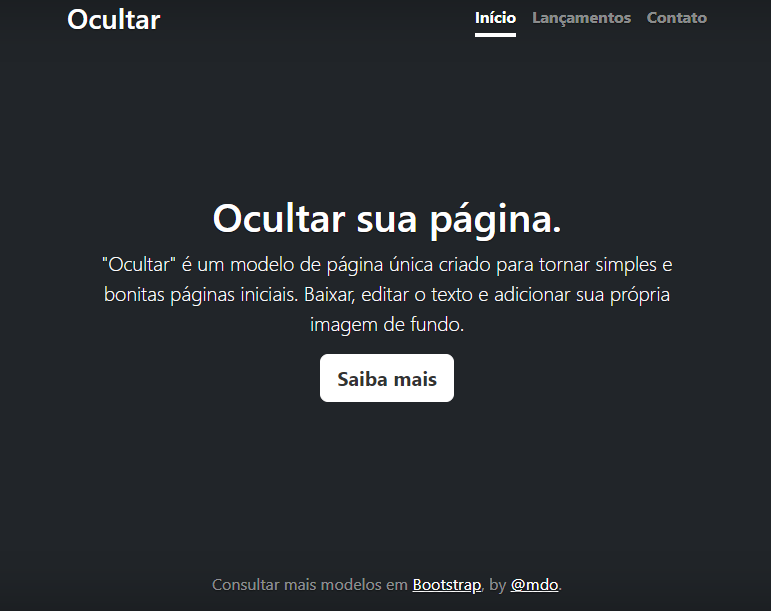

# índice
[Projeto de portifólio pessoal]()
[Descrição](#descri%C3%A7%C3%A3o)  
[Funcionalidades](#funcionalidades)  
[Tecnologias utilizadas](#tecnologias-utilizadas)  
[Fontes consultadas](#fontes-consultadas)  
[Autores](#autores)  

# Projeto de Portifólio Pessoal - Introdução

Usando as tecnologias do HTML, construimos um projeto com o uso de Bootstrap com o objetivo de treinar o uso do README. 

## Descrição

## Funcionalidades

### Tecnologias utilizadas

Neste projetos tivemos o uso de HTML, CSS, Bootstrap, Git, Git Hub.

## Fontes consultadas

Ao decorrer do desenvolvimento consultei alguns links para me ajudar na criação do README, são eles:
link1:
link2:

## Autores

Sarah Ozeto